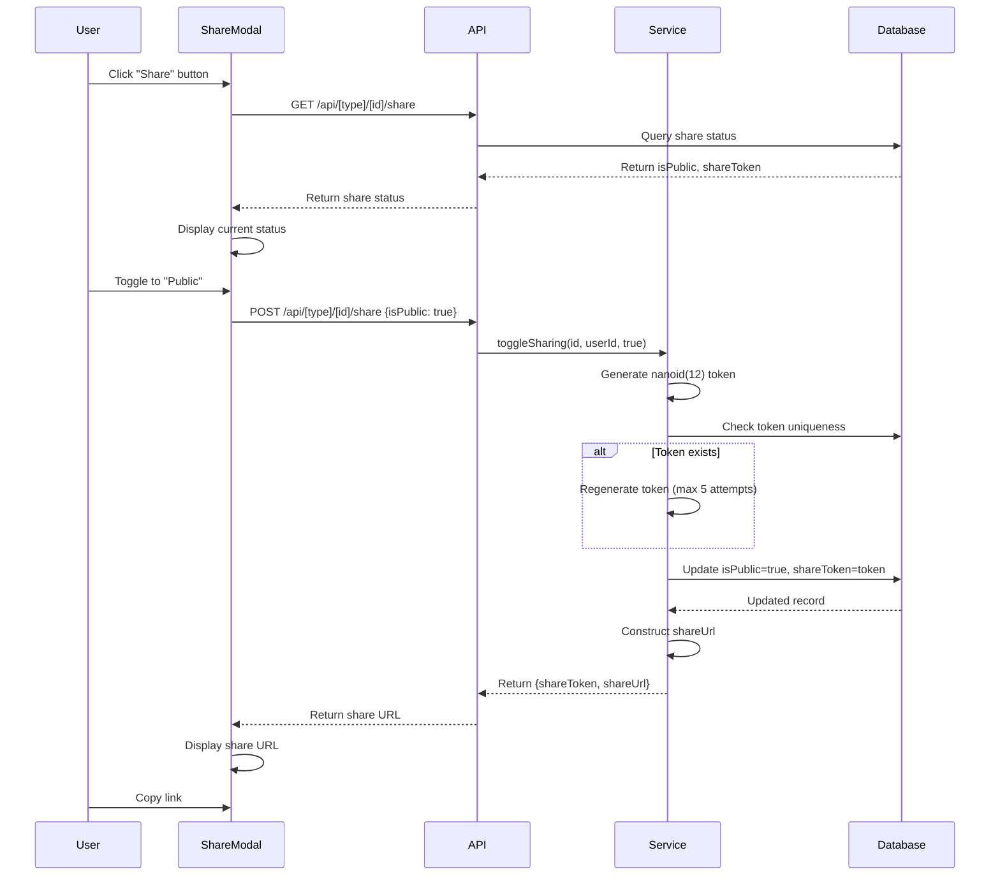
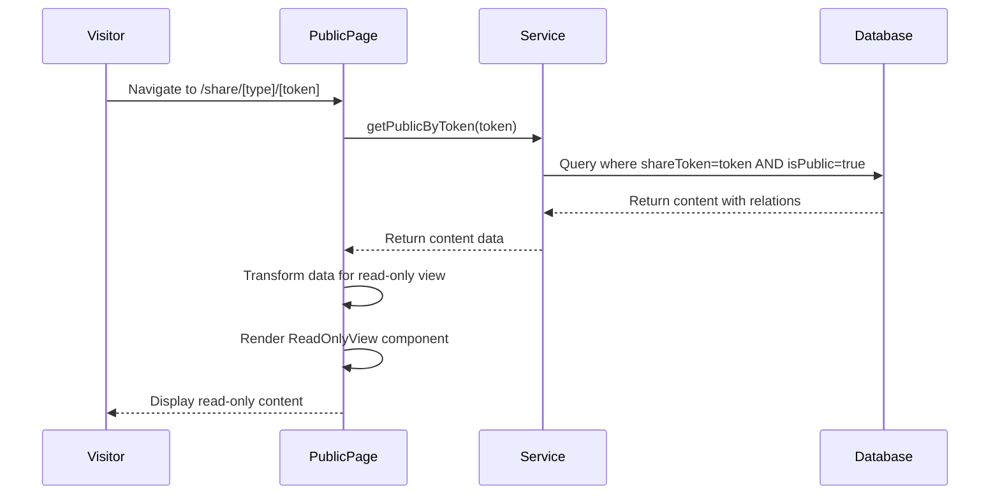
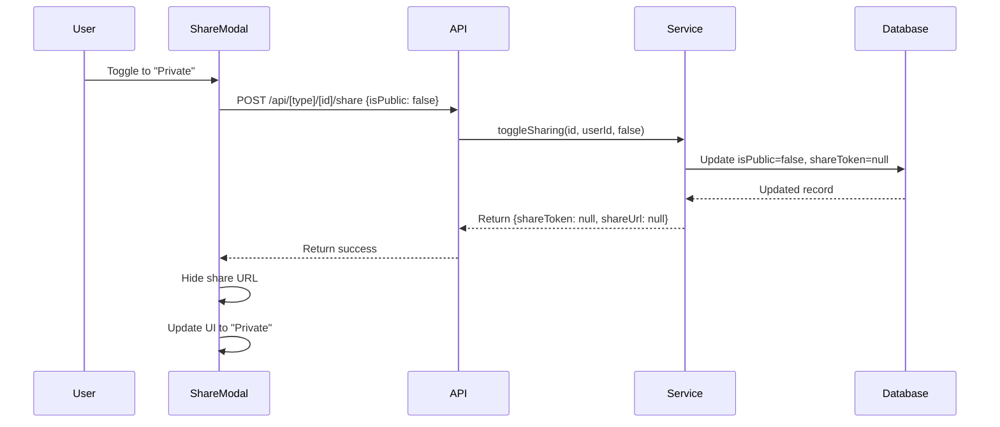

# Shared Source and Chat Feature Documentation

## Table of Contents
1. [Overview](#overview)
2. [Architecture](#architecture)
3. [Database Schema](#database-schema)
4. [Impacted Files](#impacted-files)
5. [How to Make Changes](#how-to-make-changes)
6. [Sequence Diagrams](#sequence-diagrams)
7. [Approach Taken](#approach-taken)
8. [API Endpoints](#api-endpoints)
9. [Security Considerations](#security-considerations)

## Overview

The Shared Source and Chat feature allows users to share their sources and chat conversations publicly via shareable links. When a user enables sharing, a unique token is generated that can be used to access the content without authentication. This feature enables users to showcase their work, collaborate, and share content with others.

### Key Features
- **Token-based Sharing**: Each shared item gets a unique 12-character token
- **Public Access**: Shared content is accessible without authentication
- **Read-only View**: Shared content is displayed in a read-only format
- **Toggle Sharing**: Users can enable/disable sharing at any time
- **Snapshot-based**: Only content up to the sharing point is visible (future updates aren't included)

## Architecture

### High-Level Architecture

```
┌─────────────────────────────────────────────────────────────┐
│                    User Interface Layer                       │
├─────────────────────────────────────────────────────────────┤
│  ShareModal (UI Component)                                    │
│  ├── Chat History Component                                  │
│  └── Source Table Component                                  │
└─────────────────────────────────────────────────────────────┘
                            │
                            ▼
┌─────────────────────────────────────────────────────────────┐
│                    API Layer                                  │
├─────────────────────────────────────────────────────────────┤
│  GET/POST /api/chat/conversations/[chatId]/share            │
│  GET/POST /api/content/sources/[id]/share                   │
└─────────────────────────────────────────────────────────────┘
                            │
                            ▼
┌─────────────────────────────────────────────────────────────┐
│                  Service Layer                                │
├─────────────────────────────────────────────────────────────┤
│  toggleChatSharing()                                         │
│  toggleSourceSharing()                                       │
│  getPublicChatByToken()                                      │
│  getPublicSourceByToken()                                    │
└─────────────────────────────────────────────────────────────┘
                            │
                            ▼
┌─────────────────────────────────────────────────────────────┐
│                  Database Layer                               │
├─────────────────────────────────────────────────────────────┤
│  Chat Model (isPublic, shareToken)                          │
│  Source Model (isPublic, shareToken)                        │
└─────────────────────────────────────────────────────────────┘
                            │
                            ▼
┌─────────────────────────────────────────────────────────────┐
│              Public View Layer (No Auth)                     │
├─────────────────────────────────────────────────────────────┤
│  /share/chat/[token] → ReadOnlyChatInterface                 │
│  /share/source/[token] → ReadOnlySourceView                  │
└─────────────────────────────────────────────────────────────┘
```

### Component Hierarchy

```
ShareModal
├── Fetches share status (GET)
├── Toggles sharing (POST)
└── Displays share URL

Public Pages (No Auth Required)
├── /share/chat/[token]
│   ├── SharedContentHeader
│   └── ReadOnlyChatInterface
│       └── Message components (read-only)
│
└── /share/source/[token]
    ├── SharedContentHeader
    └── ReadOnlySourceView
        ├── Source Preview
        ├── Content Type Navigation
        └── Generated Content Display
```

## Database Schema

### Chat Model

```prisma
model Chat {
  id         String    @id @default(cuid())
  userId     String
  user       User      @relation(fields: [userId], references: [id], onDelete: Cascade)
  title      String?
  sourceId   String?
  source     Source?   @relation(fields: [sourceId], references: [id], onDelete: SetNull)
  messages   Message[]
  isPublic   Boolean   @default(false)      // Sharing flag
  shareToken String?   @unique              // Unique token for sharing
  createdAt  DateTime  @default(now())
  updatedAt  DateTime  @updatedAt

  @@index([userId, updatedAt(sort: Desc)])
  @@index([sourceId])
  @@index([shareToken])                    // Indexed for fast lookups
}
```

### Source Model

```prisma
model Source {
  id               String             @id @default(cuid())
  userId           String
  user             User               @relation(fields: [userId], references: [id], onDelete: Cascade)
  title            String?
  sourceUrl        String
  sourceType       String
  content          String?            @db.Text
  description      String?            @db.Text
  mediaUrl         String?
  isPublic         Boolean            @default(false)      // Sharing flag
  shareToken       String?            @unique              // Unique token for sharing
  createdAt        DateTime           @default(now())
  updatedAt        DateTime           @updatedAt
  generatedContent GeneratedContent[]
  chats            Chat[]

  @@index([userId])
  @@index([shareToken])                                    // Indexed for fast lookups
}
```

### Key Schema Points

1. **isPublic**: Boolean flag indicating if the item is shared
2. **shareToken**: Unique nullable string token (12 characters using nanoid)
3. **Indexes**: Both `shareToken` fields are indexed for fast lookups
4. **Uniqueness**: `shareToken` is unique to prevent collisions
5. **Cascade Deletes**: When user is deleted, their chats/sources are deleted

## Impacted Files

### Frontend Components

#### Share UI Components
- `src/components/share/ShareModal.tsx`
  - Main modal for toggling sharing
  - Handles both chat and source sharing
  - Displays share URL and copy functionality

- `src/components/share/SharedContentHeader.tsx`
  - Header component for public share pages
  - Shows logo, shared by info, and CTA button

#### Read-Only View Components
- `src/components/chat/ReadOnlyChatInterface.tsx`
  - Read-only chat interface for public viewing
  - Displays messages without interaction capabilities

- `src/components/content/ReadOnlySourceView.tsx`
  - Read-only source view for public viewing
  - Shows source content and generated content in read-only mode

#### Integration Points
- `src/components/chat/ChatHistory.tsx`
  - Integrates ShareModal for chat sharing
  - Triggers share modal from chat list

- `src/components/content/source-table.tsx`
  - Integrates ShareModal for source sharing
  - Triggers share modal from source table actions

### API Routes

#### Chat Sharing API
- `src/app/api/chat/conversations/[chatId]/share/route.ts`
  - `GET`: Retrieve current share status
  - `POST`: Toggle sharing (enable/disable)

#### Source Sharing API
- `src/app/api/content/sources/[id]/share/route.ts`
  - `GET`: Retrieve current share status
  - `POST`: Toggle sharing (enable/disable)

#### Public Access APIs (Optional)
- `src/app/api/share/chat/[token]/route.ts`
  - Alternative API endpoint for fetching shared chat data

- `src/app/api/share/source/[token]/route.ts`
  - Alternative API endpoint for fetching shared source data

### Public Pages (No Authentication)

- `src/app/share/chat/[token]/page.tsx`
  - Public page for viewing shared chats
  - Server-side rendered with token lookup

- `src/app/share/source/[token]/page.tsx`
  - Public page for viewing shared sources
  - Server-side rendered with token lookup

- `src/app/share/layout.tsx`
  - Layout wrapper for share pages

### Service Layer

- `src/lib/server/services/chat.service.ts`
  - `toggleChatSharing()`: Toggle chat sharing status
  - `getPublicChatByToken()`: Retrieve public chat by token

- `src/lib/server/services/content/content.source.service.ts`
  - `toggleSourceSharing()`: Toggle source sharing status
  - `getPublicSourceByToken()`: Retrieve public source by token

### Database

- `prisma/schema.prisma`
  - Chat model with `isPublic` and `shareToken` fields
  - Source model with `isPublic` and `shareToken` fields
  - Indexes on `shareToken` for performance

## How to Make Changes

### Adding Sharing to a New Content Type

1. **Update Database Schema**
   ```prisma
   model NewContentType {
     // ... existing fields
     isPublic   Boolean   @default(false)
     shareToken String?   @unique
     // ...
     @@index([shareToken])
   }
   ```

2. **Create Service Functions**
   ```typescript
   // In appropriate service file
   export async function toggleNewContentTypeSharing(
     id: string,
     userId: string,
     isPublic: boolean
   ): Promise<{ shareToken: string | null; shareUrl: string | null }> {
     // Verify ownership
     // Generate token if isPublic
     // Update database
     // Return token and URL
   }

   export async function getPublicNewContentTypeByToken(token: string) {
     // Query by shareToken and isPublic
     // Return content with relations
   }
   ```

3. **Create API Routes**
   ```typescript
   // src/app/api/new-content-type/[id]/share/route.ts
   export async function GET(request: Request, { params }: RouteParams) {
     // Get share status
   }

   export async function POST(request: Request, { params }: RouteParams) {
     // Toggle sharing
   }
   ```

4. **Create Public Page**
   ```typescript
   // src/app/share/new-content-type/[token]/page.tsx
   export default async function PublicNewContentTypePage({ params }: PageProps) {
     const { token } = await params;
     const content = await getPublicNewContentTypeByToken(token);
     // Render read-only view
   }
   ```

5. **Create Read-Only Component**
   ```typescript
   // src/components/new-content-type/ReadOnlyView.tsx
   export function ReadOnlyNewContentTypeView({ content }: Props) {
     // Display read-only content
   }
   ```

6. **Update ShareModal** (if needed)
   - ShareModal already supports generic types, but verify it works with your new type

### Modifying Share Token Generation

The token generation uses `nanoid(12)` for a 12-character URL-safe token. To modify:

```typescript
// In service files
import { nanoid } from "nanoid";

// Change length
shareToken = nanoid(16); // 16 characters instead of 12

// Or use custom alphabet
import { customAlphabet } from "nanoid";
const nanoid = customAlphabet("0123456789ABCDEFGHIJKLMNOPQRSTUVWXYZ", 12);
```

### Changing Share URL Format

Update the base URL construction in service files:

```typescript
const baseUrl = process.env.NEXT_PUBLIC_APP_URL || "http://localhost:3000";
shareUrl = `${baseUrl}/share/chat/${shareToken}`;
```

### Adding Share Expiration

1. Add expiration field to schema:
   ```prisma
   shareExpiresAt DateTime?
   ```

2. Update service to set expiration:
   ```typescript
   if (isPublic) {
     shareToken = nanoid(12);
     shareExpiresAt = new Date(Date.now() + 30 * 24 * 60 * 60 * 1000); // 30 days
   }
   ```

3. Check expiration in public retrieval:
   ```typescript
   const content = await prisma.chat.findUnique({
     where: {
       shareToken: token,
       isPublic: true,
       shareExpiresAt: { gt: new Date() }, // Not expired
     },
   });
   ```

### Adding Access Control (Password Protection)

1. Add password field:
   ```prisma
   sharePassword String? // Hashed password
   ```

2. Update API to require password:
   ```typescript
   // In public page
   const password = searchParams.get("password");
   // Verify password before displaying
   ```

## Sequence Diagrams

### Enabling Sharing (Chat/Source)



### Viewing Shared Content



### Disabling Sharing



## Approach Taken

### Design Decisions

1. **Token-based Sharing**
   - **Why**: Simple, secure, no need for complex permission systems
   - **Implementation**: 12-character nanoid tokens (URL-safe, unique)
   - **Uniqueness**: Retry mechanism (up to 5 attempts) if collision occurs

2. **Snapshot-based Content**
   - **Why**: Prevents confusion about what's shared, maintains privacy
   - **Implementation**: Only content existing at share time is visible
   - **Future updates**: Not included in shared view

3. **Read-only Views**
   - **Why**: Prevents unauthorized modifications
   - **Implementation**: Separate read-only components (ReadOnlyChatInterface, ReadOnlySourceView)
   - **No interactions**: Copy, view only - no edit, delete, or generate

4. **No Authentication Required**
   - **Why**: Easy sharing, no barriers for viewers
   - **Security**: Token acts as access control
   - **Revocation**: User can disable sharing anytime

5. **Indexed Token Lookups**
   - **Why**: Fast public page loads
   - **Implementation**: Database indexes on `shareToken` fields

### Security Considerations

1. **Token Uniqueness**: Ensured through database unique constraint and retry logic
2. **Ownership Verification**: Only owners can toggle sharing
3. **Public Access Control**: Only items with `isPublic=true` and valid token are accessible
4. **No Sensitive Data**: User emails and other sensitive info are filtered in public views
5. **Token Length**: 12 characters provide good security (72 bits of entropy)

### Performance Optimizations

1. **Database Indexes**: `shareToken` fields are indexed for fast lookups
2. **Server-side Rendering**: Public pages are SSR for better SEO and performance
3. **Selective Queries**: Only necessary fields are selected in queries
4. **Caching Headers**: Public API endpoints include no-cache headers

### Error Handling

1. **Token Not Found**: Returns 404 (not found)
2. **Unauthorized Access**: Returns 401 for API endpoints
3. **Invalid Requests**: Returns 400 with error messages
4. **Server Errors**: Returns 500 with generic error messages (details logged server-side)

## API Endpoints

### Chat Sharing

#### GET `/api/chat/conversations/[chatId]/share`
Get current share status for a chat.

**Authentication**: Required (Clerk)

**Response**:
```json
{
  "success": true,
  "data": {
    "isPublic": true,
    "shareToken": "abc123def456",
    "shareUrl": "https://app.getartifacts.io/share/chat/abc123def456"
  }
}
```

#### POST `/api/chat/conversations/[chatId]/share`
Toggle sharing for a chat.

**Authentication**: Required (Clerk)

**Request Body**:
```json
{
  "isPublic": true
}
```

**Response**:
```json
{
  "success": true,
  "data": {
    "shareToken": "abc123def456",
    "shareUrl": "https://app.getartifacts.io/share/chat/abc123def456"
  }
}
```

### Source Sharing

#### GET `/api/content/sources/[id]/share`
Get current share status for a source.

**Authentication**: Required (Clerk)

**Response**: Same format as chat sharing

#### POST `/api/content/sources/[id]/share`
Toggle sharing for a source.

**Authentication**: Required (Clerk)

**Request Body**: Same format as chat sharing

**Response**: Same format as chat sharing

## Security Considerations

### Token Security

- **Length**: 12 characters provide sufficient entropy (72 bits)
- **Uniqueness**: Database unique constraint prevents collisions
- **Randomness**: nanoid uses cryptographically strong random generator
- **URL-safe**: Tokens are URL-safe (no special encoding needed)

### Access Control

- **Ownership Verification**: Only content owners can enable/disable sharing
- **Public Access**: Only items with `isPublic=true` are accessible via token
- **No Authentication Bypass**: Public pages don't grant access to other user content

### Data Privacy

- **Selective Data**: Only necessary data is exposed in public views
- **User Information**: Limited user info (name only) in public views
- **No Sensitive Fields**: Email and other sensitive data excluded

### Best Practices

1. **Token Rotation**: Users can regenerate tokens by toggling sharing off/on
2. **Revocation**: Immediate revocation by setting `isPublic=false`
3. **Monitoring**: Log share access for security auditing (future enhancement)
4. **Rate Limiting**: Consider rate limiting on public endpoints (future enhancement)

## Testing Considerations

### Unit Tests

- Token generation uniqueness
- Service function error handling
- Data transformation for read-only views

### Integration Tests

- API endpoint authentication
- Share toggle functionality
- Public page access with valid/invalid tokens

### E2E Tests

- Complete share flow (enable → copy link → view)
- Disable sharing flow
- Invalid token handling

## Future Enhancements

1. **Share Expiration**: Time-based expiration for shared links
2. **Password Protection**: Optional password for shared links
3. **Access Analytics**: Track views and access patterns
4. **Custom Domains**: Support for custom share domains
5. **Share Permissions**: Fine-grained permissions (view, comment, etc.)
6. **Bulk Sharing**: Share multiple items at once
7. **Share Templates**: Pre-configured share settings

## Troubleshooting

### Common Issues

1. **Token Collision**: Extremely rare, handled by retry logic (max 5 attempts)
2. **Share URL Not Working**: Check `NEXT_PUBLIC_APP_URL` environment variable
3. **Content Not Visible**: Verify `isPublic=true` and token matches
4. **Permission Denied**: Ensure user owns the content they're trying to share

### Debugging

- Check database: `SELECT * FROM Chat WHERE shareToken = 'token'`
- Verify environment variables: `NEXT_PUBLIC_APP_URL`
- Check server logs for errors in service functions
- Verify token format (12 characters, URL-safe)
